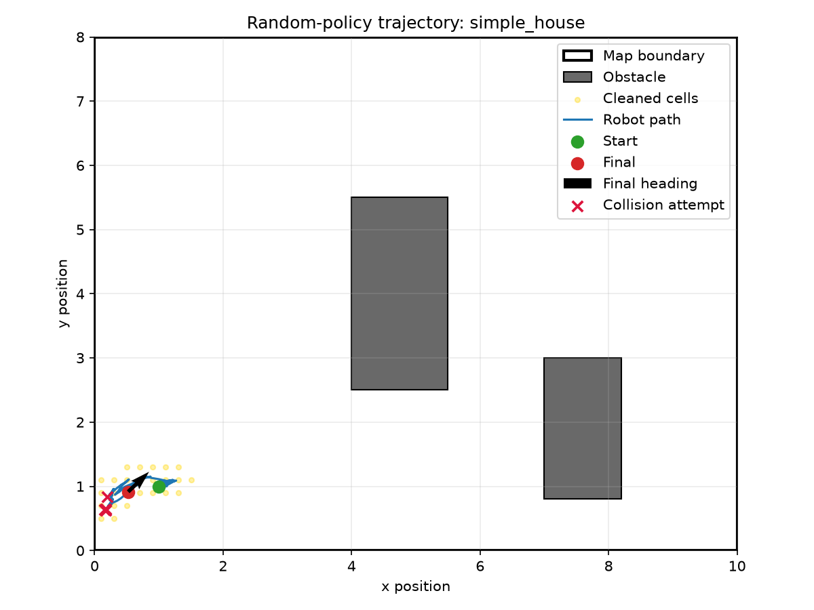
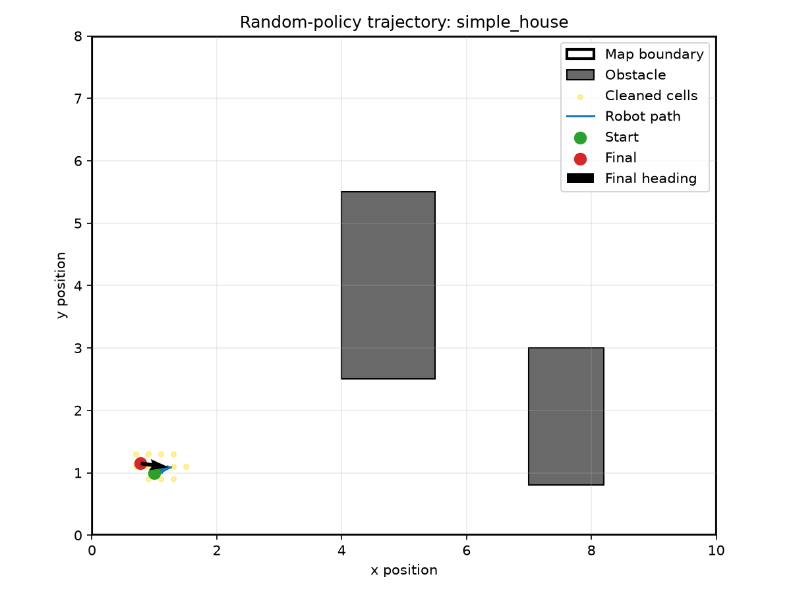
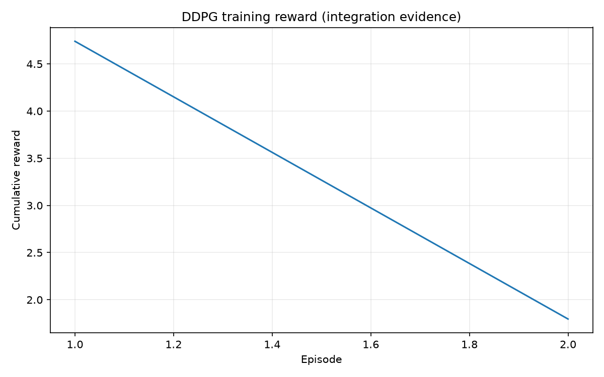
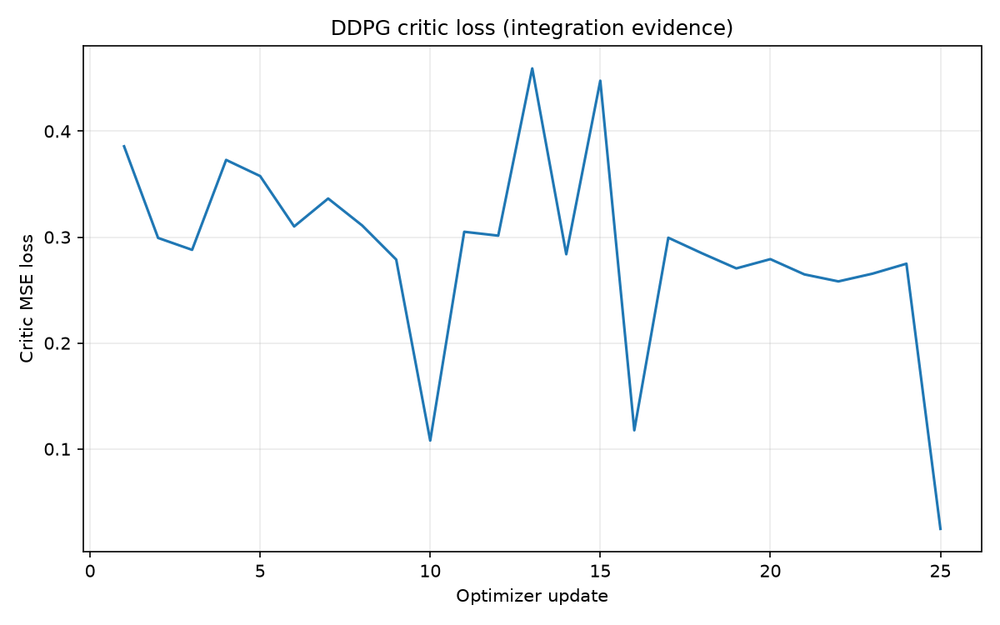
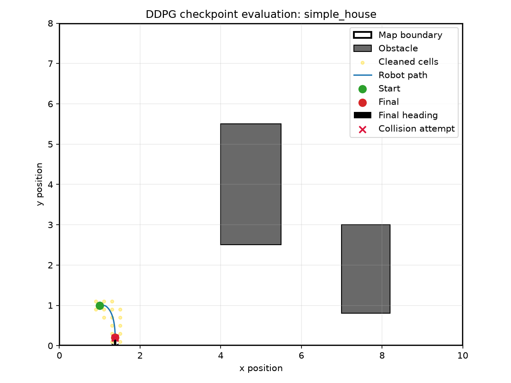

# Exercise 05: DDPG Robotic Vacuum Simulator

A compact, inspectable Python project for Bar-Ilan University Exercise 05. It combines a project-owned continuous-control vacuum simulator with a from-scratch PyTorch DDPG agent, reproducible CLI evidence, an SDK facade, and a local Tkinter GUI.

## Current status


> **Current status:** the simulator, SDK, CLI/GUI demos, DDPG networks and updates, replay, exploration, checkpointing, training, evaluation, plots, tests, and reports are implemented. A two-episode smoke run proves integration only; it does not demonstrate convergence or a useful trained policy.

> **Teacher/reviewer shortcut:** open the [Teacher Evidence Pack](docs/TEACHER_EVIDENCE.md) for committed screenshots, assessment traceability, experimental conclusions, resource costs, extensibility, and quality evidence.

## Exercise 05 compliance summary

| Requirement | Status | Evidence |
|---|---|---|
| Custom 2D simulator | Implemented | Project-owned geometry, kinematics, sensors, collision, coverage, and reward modules |
| No Gymnasium or Gazebo | Implemented | No forbidden dependency or import |
| Continuous action in `[-1, 1]` | Implemented | Normalized linear and angular commands with defensive clipping |
| Continuous state vector | Implemented | Seven rays, velocities, heading, coverage, and contact: 13 values by default |
| Trajectory visualization | Implemented | Random-policy trajectory, cleaned cells, collisions, start/final pose, and heading |
| Actor, critic, and final `tanh` | Implemented | PyTorch networks with tested shapes and action bounds |
| Replay, Gaussian noise, and soft updates | Implemented | Seeded replay/noise and exact interpolation unit tests |
| Learning and critic-loss curves | Implemented | Generated from recorded smoke-run metrics |
| Checkpoint evaluation | Implemented | Deterministic rollout; no convergence claim |
| HouseExpo | Partial boundary only | Native sample map plus loader protocol; no HouseExpo parser claim |

The assignment PDFs are interpreted in this order: Exercise 05 specification, Lecture 09 DDPG notes, DDPG autonomous blueprint, and professional software guidelines.

## Quick start

Requirements:

- Python 3.11 or newer
- [`uv`](https://docs.astral.sh/uv/)
- Tkinter for the optional GUI (included in standard Windows/macOS Python; minimal Linux installations may require `python3-tk`)

Install the locked runtime and development environment:

```bash
uv sync --extra dev
```

On machines with an institutional certificate chain, use:

```bash
uv sync --extra dev --system-certs
```

## Quick demo

Generate the complete random-policy evidence bundle:

```bash
uv run robot-vacuum demo --max-steps 150 --seed 42
```

Equivalent convenience alias:

```bash
uv run robot-vacuum make-demo --max-steps 150 --seed 42
```

Run the small DDPG integration check and evaluate its checkpoint:

```bash
uv run robot-vacuum train --config config/smoke_training.json
uv run robot-vacuum evaluate --checkpoint results/checkpoints/best_actor.pt
```

For the configured 200-episode baseline, use `uv run robot-vacuum train --config config/default_training.json`. Runtime and learning quality depend on the machine and seed; this repository does not claim that the baseline converges.

The CLI delegates to `VacuumSDK`, runs one deterministic seeded random-policy episode, and prints the resulting metrics and paths. This demonstrates simulator integration—not policy learning.

## GUI demo

Launch the local Python-only Tkinter interface:

```bash
uv run robot-vacuum gui
```

The GUI provides:

- Reset, single random step, scheduled episode run, and pause/stop controls.
- Seed, maximum-step, map-path, and display-delay inputs.
- Map boundaries, rectangular obstacles, cleaned cells, trajectory, collision attempts, robot position, and heading.
- Current step, reward, collisions, coverage, action, state-vector length, and saved-artifact status.
- **Save screenshot** and **Generate report** actions through the SDK.

The screenshot action writes `results/screenshots/gui_demo.png`. For portability, this is a Matplotlib rendering of the GUI's current map view—not an operating-system capture of the surrounding window chrome. See the [GUI guide](docs/GUI_GUIDE.md).

## Generated artifacts

Canonical runtime outputs are reproducible, generated locally, and intentionally ignored by Git. Curated, reviewed copies are committed under `assets/evidence/` so reviewers can inspect them directly on GitHub.

| Artifact | Path | Generation | Status |
|---|---|---|---|
| Random-policy trajectory | `results/trajectories/random_policy.png` | Quick demo command | Implemented; generated locally |
| Random-policy metrics | `results/metrics/random_policy_metrics.json` | Quick demo command | Implemented; generated locally |
| Random-policy report | `results/reports/random_policy_report.md` | Quick demo command | Implemented; generated locally |
| GUI map-view screenshot | `results/screenshots/gui_demo.png` | GUI **Save screenshot** button | Implemented; generated locally |
| Learning curve | `results/plots/learning_curve.png` | Smoke/default training command | Implemented; generated locally |
| Critic-loss graph | `results/plots/critic_loss.png` | Smoke/default training command | Implemented; generated locally |
| Evaluation trajectory | `results/trajectories/evaluation_trajectory.png` | Evaluation command | Implemented; generated locally |
| Training metrics | `results/metrics/training_metrics.json` | Smoke/default training command | Implemented; generated locally |
| Actor checkpoint | `results/checkpoints/best_actor.pt` | Smoke/default training command | Implemented; generated locally |

<details open>
<summary><strong>Committed evidence previews</strong></summary>

These reviewed snapshots are committed. Their canonical `results/` counterparts can be regenerated with the commands above.

### Random-policy trajectory



### GUI map-view screenshot



### DDPG smoke learning curve



### DDPG smoke critic loss



### DDPG smoke-checkpoint evaluation



</details>

The two-episode curves and evaluation trajectory are integration evidence, not convergence evidence. See the [artifact index](docs/ARTIFACT_INDEX.md) for regeneration commands.

## DDPG architecture

The implemented DDPG flow is:

```text
state ──> Actor μ(s) ──tanh──> continuous action [-1, 1]
  │                              │
  └──────────────┬───────────────┘
                 v
            Critic Q(s, a)

environment transitions ──> replay buffer ──> mini-batch updates
                                      │
                         target actor + target critic
                                      │
                     soft update: τ online + (1-τ) target
```

Implemented algorithm properties:

- Actor maps the environment's state dimension to two continuous controls with final `tanh`.
- Critic consumes concatenated state and action and returns one scalar Q-value.
- Gaussian noise applies during training only; evaluation is deterministic.
- Replay samples uniform mini-batches after warm-up.
- Critic minimizes terminal-masked Bellman MSE.
- Actor minimizes `-critic(state, actor(state)).mean()`.
- Target actor and critic update softly with configurable `tau`.

The full mathematical and test contract is in [docs/PRD_ddpg_algorithm.md](docs/PRD_ddpg_algorithm.md).

## Simulator design

The simulator is framework-free and independent of the GUI:

```text
CLI / Tkinter GUI
        |
        v
   VacuumSDK
        |
        v
   DemoSession ─────────> reports and visualization
        |
        v
VacuumEnvironment
   |-- validated configuration
   |-- robot kinematics and action clipping
   |-- swept boundary/obstacle collision
   |-- normalized distance sensors
   |-- first-visit CoverageGrid
   |-- normalized observation assembly
   `-- decomposed reward and episode lifecycle
```

Default action:

```text
[normalized_linear_command, normalized_angular_command] ∈ [-1, 1]²
```

Default state order:

```text
7 normalized rays
+ normalized linear/angular velocity
+ sin(theta), cos(theta)
+ coverage ratio
+ collision/contact flag
= 13 values
```

The native map schema supports rectangular bounds, rectangular obstacles, and a start pose. The loader interface is an extension point toward HouseExpo, but the included `simple_house.json` is project-native data.

## Configuration

`pyproject.toml` is the dependency and tool-configuration source of truth; `uv.lock` is tracked. No `requirements.txt` is used.

| File | Purpose |
|---|---|
| `config/default_simulator.json` | Geometry, dynamics, sensors, coverage, termination, and reward defaults |
| `config/default_training.json` | 200-episode baseline DDPG hyperparameters |
| `config/smoke_training.json` | Two-episode integration configuration |
| `data/sample_maps/simple_house.json` | Native sample floor map |

Important simulator defaults:

| Parameter | Value |
|---|---:|
| Time step | `0.1` |
| Robot radius | `0.2` |
| Max linear speed | `1.0` |
| Max angular speed | `2.0` |
| Sensor rays | `7` |
| Sensor max range | `3.0` |
| Target coverage | `0.9` |
| Episode limit | `500` steps |

Training metrics record the resolved `actor_lr`, `critic_lr`, `gamma`, `tau`, `noise_sigma`, `batch_size`, `replay_buffer_size`, network sizes, seed, duration, and generated paths.

## Testing and quality gates

```bash
uv run pytest
uv run pytest --cov=robot_vacuum_ddpg --cov-report=term-missing
uv run ruff check .
```

Audited result:

| Gate | Result |
|---|---|
| Tests | 19 passed |
| Coverage | 88.08% against an 85% gate |
| Ruff | Zero violations |
| Module size | Focused domain modules; largest SDK facade is 175 nonblank, non-comment lines |
| Forbidden frameworks | None in dependencies or executable imports |
| Secrets | None; `.env-example` documents that no secrets are required |

Thin CLI/Tkinter rendering wrappers are excluded from aggregate coverage; GUI-independent view-model conversion is unit tested and GUI initialization has been smoke checked.

## Reports and documentation

- [Product requirements](docs/PRD.md)
- [Implementation plan](docs/PLAN.md)
- [Tracked work and completion state](docs/TODO.md)
- [DDPG algorithm requirements](docs/PRD_ddpg_algorithm.md)
- [Simulator requirements](docs/PRD_simulator.md)
- [Summary report](docs/SUMMARY_REPORT.md)
- [Final submission audit](docs/FINAL_AUDIT.md)
- [Generated artifact index](docs/ARTIFACT_INDEX.md)
- [Coding style report](docs/STYLE_REPORT.md)
- [Demo guide](docs/DEMO_GUIDE.md)
- [GUI guide](docs/GUI_GUIDE.md)
- [Results guide](docs/RESULTS_GUIDE.md)
- [Teacher evidence pack](docs/TEACHER_EVIDENCE.md)
- [Experiment and analysis log](docs/EXPERIMENTS.md)
- [Resource and cost awareness](docs/RESOURCE_AND_COST.md)
- [Quality standards and CI policy](docs/QUALITY_STANDARDS.md)
- [AI prompt and decision log](docs/PROMPT_LOG.md)

## Known limitations

- The recorded DDPG evidence is a two-episode, 40-step smoke run. It proves integration, not convergence.
- The smoke checkpoint's deterministic evaluation reached only 0.89% coverage in 500 steps; it is not a useful trained policy.
- A longer baseline has not been run or interpreted, and no multi-seed performance claim is made.
- Physics are simplified and deterministic; sensors are perfect and localization is known.
- Obstacles are axis-aligned rectangles; coverage is a grid approximation.
- Full HouseExpo parsing and polygon geometry are not implemented.
- The GUI screenshot fallback contains the map view rather than Tkinter controls/window chrome.

## Future work / final improvements

1. Run and compare longer multi-seed experiments before making any convergence claim.
2. Add reward/noise sensitivity analysis and checkpoint-selection evaluation metrics.
3. Add terminal-mask and checkpoint round-trip tests beyond the current required suite.
4. Add a tested HouseExpo polygon adapter without changing the simulator's public state/action contract.
5. Review and intentionally commit the implementation and generated-evidence policy before submission.

## Academic transparency

The project and documentation are AI-assisted. Material prompts and decisions are recorded in [docs/PROMPT_LOG.md](docs/PROMPT_LOG.md). Generated evidence is separated from planned evidence, and no DDPG convergence or trained-policy result is claimed without corresponding code and files.
