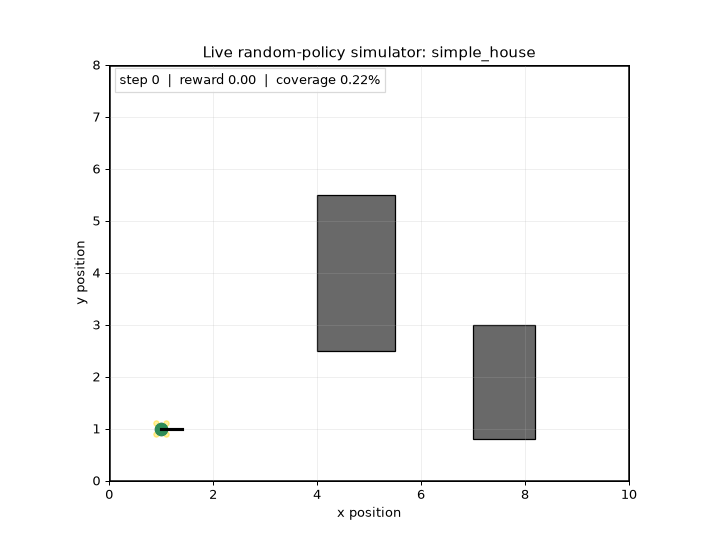
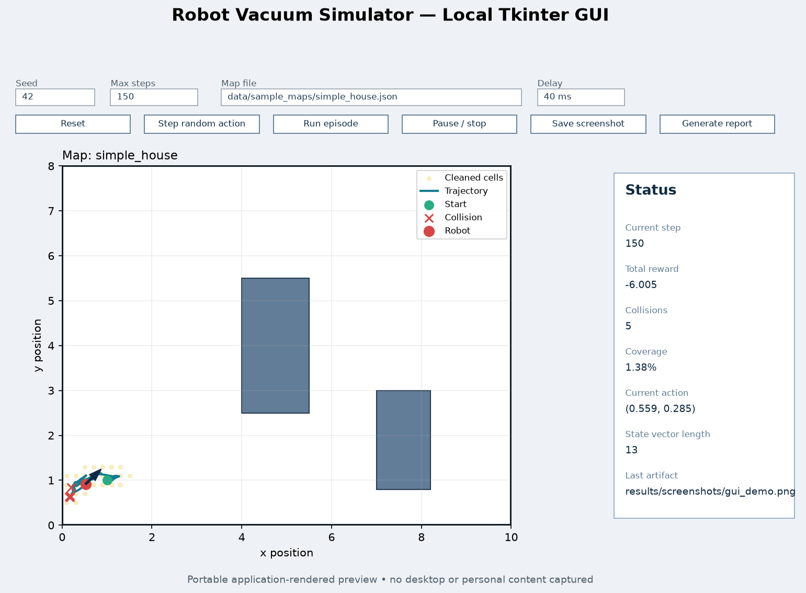

# Exercise 05: DDPG Robotic Vacuum Simulator

A project-owned continuous-control robot-vacuum simulator with a from-scratch PyTorch DDPG pipeline, SDK, CLI, local Tkinter GUI, reproducible evidence, and automated quality gates.


> **Honest result status:** the complete DDPG software path is implemented and smoke tested. The recorded run contains only two episodes and proves integration, not convergence or useful learned performance.

## Live simulator demo — seeded random policy



This committed animation is rendered exclusively from immutable SDK snapshots. It shows movement, trajectory history, cleaned cells, collision attempts, step count, cumulative reward, and coverage. It never captures desktop pixels. The policy is seeded and random, so the animation demonstrates the simulator rather than trained behavior.

```bash
uv run robot-vacuum record-demo --max-steps 150 --seed 42 --frame-stride 3
```

## Local GUI demo



The repository includes a real Python-only Tkinter GUI—not a browser mock-up. The preview
above is rendered from the same immutable SDK snapshot used by the window, so it safely
documents the controls, map, trajectory, heading, cleaned cells, and live status without
capturing the desktop or unrelated personal content.

```bash
uv run robot-vacuum gui
```

The GUI currently drives the seeded random-policy simulator for interactive inspection.
DDPG training and deterministic checkpoint evaluation use the CLI and produce separate,
honestly labelled evidence below.

## Reviewer map: assessment evidence

| Assessment area | What is demonstrated | Direct evidence |
|---|---|---|
| **Project planning** | Requirements, phased implementation, acceptance criteria, risks, and tracked work | [PRD](docs/PRD.md), [plan](docs/PLAN.md), [TODO](docs/TODO.md) |
| **Code documentation** | Typed package boundaries, design-focused docstrings, setup and operation guides | [DDPG PRD](docs/PRD_ddpg_algorithm.md), [simulator PRD](docs/PRD_simulator.md), [documentation index](#documentation-index) |
| **Testing and quality** | 21 tests, 89.17% branch-aware coverage, linting, edge cases, and CI enforcement | [tests](tests), [quality workflow](.github/workflows/quality.yml), [quality policy](docs/QUALITY_STANDARDS.md) |
| **UI and user experience** | Live animation, local GUI, controls, status panel, artifact export | [GUI guide](docs/GUI_GUIDE.md), [map view](assets/evidence/gui_map_view.png), [full GUI layout](assets/evidence/gui_full_window.png) |
| **Configuration and security** | Locked dependencies, validated JSON configuration, no required secrets, generic personal-document exclusions | [configuration](#configuration-and-portability), [privacy/security policy](docs/PRIVACY_SECURITY.md) |
| **Research and analysis** | Explicit questions, hypotheses, observations, conclusions, and next experiment matrix | [experiment log](docs/EXPERIMENTS.md), [recorded metrics](assets/evidence/smoke_training_metrics.json) |
| **Version management** | Git milestones, PR-based delivery, and visible AI-assisted decision history | [prompt and decision log](docs/PROMPT_LOG.md), [final audit](docs/FINAL_AUDIT.md) |
| **Cost awareness** | Direct cost, runtime/storage measurements, replay-memory equation, scaling controls | [resource and cost analysis](docs/RESOURCE_AND_COST.md) |
| **Extensibility** | Stable SDK/environment contract and explicit seams for maps, agents, views, and reports | [architecture and extension points](#architecture-and-extensibility) |
| **Quality standards** | Locked setup, Ruff, pytest, coverage threshold, read-only CI permissions, review checklist | [quality standards](docs/QUALITY_STANDARDS.md) |

For a single-page evidence walkthrough, see the [Teacher Evidence Pack](docs/TEACHER_EVIDENCE.md).

## Exercise 05 compliance

| Requirement | Status | Implementation evidence |
|---|---|---|
| Custom simulator | Implemented | Project-owned geometry, kinematics, sensors, collision, coverage, reward, and lifecycle |
| No Gymnasium or Gazebo | Implemented | Neither appears in runtime dependencies or simulator imports |
| Continuous action | Implemented | Two normalized controls clipped to `[-1, 1]` |
| Continuous state | Implemented | 13 values by default: seven rays, two velocities, heading sine/cosine, coverage, collision |
| Actor with final `tanh` | Implemented | [`ddpg/actor.py`](src/robot_vacuum_ddpg/ddpg/actor.py) |
| Critic over state + action | Implemented | [`ddpg/critic.py`](src/robot_vacuum_ddpg/ddpg/critic.py) |
| Target networks and soft update | Implemented | [`ddpg/agent.py`](src/robot_vacuum_ddpg/ddpg/agent.py), [`soft_update.py`](src/robot_vacuum_ddpg/ddpg/soft_update.py) |
| Replay and Gaussian exploration | Implemented | [`replay_buffer.py`](src/robot_vacuum_ddpg/ddpg/replay_buffer.py), [`noise.py`](src/robot_vacuum_ddpg/ddpg/noise.py) |
| Learning/loss curves | Implemented | Generated from recorded smoke metrics; no convergence claim |
| Deterministic checkpoint evaluation | Implemented | Noise-free rollout and trajectory export |
| Full HouseExpo parsing | Not implemented | Loader protocol exists; included map uses the native rectangular schema |

## Quick start

### Requirements

- Python 3.11 or newer
- [`uv`](https://docs.astral.sh/uv/)
- CPU only; no GPU, paid API, account, or secret is required
- Tkinter only for the optional GUI; minimal Linux installations may require `python3-tk`

### Reproducible installation

```bash
git clone <repository-url>
cd DDPGAlgorithmRL
uv sync --extra dev --locked
```

For institutional certificate chains:

```bash
uv sync --extra dev --locked --system-certs
```

`pyproject.toml` is the only dependency/tool source of truth and `uv.lock` fixes the resolved environment. No `requirements.txt` is used.

## Commands

| Goal | Command | Output |
|---|---|---|
| Generate simulator evidence | `uv run robot-vacuum demo --max-steps 150 --seed 42` | PNG, JSON metrics, Markdown report |
| Generate live animation | `uv run robot-vacuum record-demo --max-steps 150 --seed 42 --frame-stride 3` | `results/animations/random_policy_demo.gif` |
| Open local GUI | `uv run robot-vacuum gui` | Interactive Tkinter window |
| Verify DDPG integration | `uv run robot-vacuum train --config config/smoke_training.json` | Metrics, checkpoint, reward/loss plots |
| Run baseline configuration | `uv run robot-vacuum train --config config/default_training.json` | Same canonical training paths |
| Evaluate checkpoint | `uv run robot-vacuum evaluate --checkpoint results/checkpoints/best_actor.pt` | Deterministic trajectory |
| Run tests | `uv run pytest` | Test result |
| Enforce coverage | `uv run pytest --cov=robot_vacuum_ddpg --cov-report=term-missing` | 85% minimum gate |
| Check style | `uv run ruff check .` | Ruff result |

The default 200-episode configuration is available but is not presented here as a completed or converged experiment.

## GUI and user experience

```bash
uv run robot-vacuum gui
```

The Python-only GUI is a thin wrapper over `VacuumSDK`; it does not duplicate simulator, collision, reward, or map logic.

- **Inputs:** seed, episode limit, map path, animation delay.
- **Controls:** reset, random step, run, pause/stop, save screenshot, generate report.
- **Map view:** boundary, rectangular obstacles, cleaned cells, path, collision attempts, robot pose and heading.
- **Status:** step, reward, collisions, coverage, current action, state-vector length, last artifact.

Map export (simulator behavior):


Full application layout (controls and status evidence):


The full-layout image is generated from immutable GUI session data; it is not an
operating-system window capture. The **Save screenshot** button writes the same privacy-safe
layout to `results/screenshots/gui_demo.png`. For an actual window-chrome capture, follow the
manual, tightly cropped workflow in [docs/SCREENSHOTS.md](docs/SCREENSHOTS.md) and replace
`assets/evidence/gui_full_window.png` after reviewing it for personal content.

## Architecture and extensibility

```text
CLI / Tkinter GUI
        |
        v
    VacuumSDK -------------------- reports / plots / GIF
        |
        +---- DemoSession -------- immutable snapshots
        |
        +---- Trainer ------------ DDPGAgent
        |                              |
        |                              +-- actor / critic / targets
        |                              +-- replay / Gaussian noise
        |
        v
 VacuumEnvironment
        +-- map + geometry
        +-- robot kinematics
        +-- sensors + observation
        +-- coverage + reward
```

The design expects requirements to change:

- Add map formats by implementing the `MapLoader` protocol.
- Add geometry behind the map/geometry boundary without changing the agent.
- Change network widths and learning parameters through JSON configuration.
- Add another agent against the stable state/action environment contract.
- Add GUI views over immutable snapshots without moving business logic into Tkinter.
- Add reports or plots from recorded metrics without recomputing simulation outcomes.

## DDPG implementation

The actor maps the continuous state to two normalized actions and ends with `tanh`:

```text
state -> Linear -> ReLU -> Linear -> ReLU -> Linear -> tanh -> action [-1, 1]^2
```

The critic concatenates state and action and returns one scalar Q-value. The agent owns online and target copies, a seeded replay buffer, Gaussian exploration during training, and deterministic evaluation.

```text
target = reward + gamma * (1 - done) * target_critic(next_state, target_actor(next_state))
critic_loss = MSE(critic(state, action), target)
actor_loss = -critic(state, actor(state)).mean()
target_param = tau * online_param + (1 - tau) * target_param
```

The full mathematical contract and code traceability table are in [docs/PRD_ddpg_algorithm.md](docs/PRD_ddpg_algorithm.md).

## Configuration and portability

| File | Purpose |
|---|---|
| [`config/default_simulator.json`](config/default_simulator.json) | Dynamics, sensors, coverage, termination, rewards, map path |
| [`config/smoke_training.json`](config/smoke_training.json) | Fast two-episode integration check |
| [`config/default_training.json`](config/default_training.json) | 200-episode baseline experiment definition |
| [`data/sample_maps/simple_house.json`](data/sample_maps/simple_house.json) | Native sample map |

Professional portability/security choices:

- All project paths resolve from the repository root; no user-specific absolute path is stored.
- JSON is validated before simulator/training work begins.
- No environment variable, paid service, or credential is required.
- `.env`, caches, runtime results, PDFs, and office documents are ignored.
- No student identifier or personal contact information is stored.
- GitHub Actions receives read-only repository-content permission.
- Runtime results are reproducible; only reviewed application-generated evidence is committed.

See [docs/PRIVACY_SECURITY.md](docs/PRIVACY_SECURITY.md) for the release checklist.

## Research and analysis

The repository distinguishes three different questions:

| Experiment | Question | Observation | Conclusion |
|---|---|---|---|
| Seeded random policy | Does the custom simulator/reporting path work? | Continuous path, collisions, coverage, JSON and report generated | Simulator integration works; no learning claim |
| Two-episode DDPG smoke run | Do replay, gradients, targets, checkpointing and plots work together? | Rewards `4.7400`, `1.7959`; 25 finite critic updates | Learning pipeline works; two samples cannot establish a trend |
| Deterministic checkpoint evaluation | Can the saved actor load and run without noise? | 500 steps, reward `-3.003`, coverage `0.89%`, two collisions | Serialization/evaluation works; policy quality is poor |


The curve decreases across two episodes. That is explicitly **not** convergence evidence. A defensible performance study would require longer training, multiple seeds, a stated success threshold, and held-out deterministic evaluation. The planned experiment matrix covers training budget, noise, reward sensitivity, seeds, and map generalization in [docs/EXPERIMENTS.md](docs/EXPERIMENTS.md).

<details>
<summary><strong>Additional recorded evidence</strong></summary>

### Critic MSE during smoke integration


### Deterministic smoke-checkpoint trajectory


### Random-policy trajectory


</details>

## Testing and quality standards

Current audited result:

| Gate | Result |
|---|---|
| Tests | 21 passed |
| Coverage | 89.17%; configured minimum is 85% |
| Ruff | Passed with zero violations |
| CI | Runs locked sync, Ruff, pytest, and coverage on pushes and pull requests |

The suite covers simulator reset/step behavior, action clipping, reward components, boundary/obstacle collisions, swept collision, map validation, GUI-independent view conversion, actor/critic shapes, action range, replay shapes/copying, Gaussian noise/clipping, exact soft updates, artifact generation, smoke training, checkpoint evaluation, and GIF recording.

Quality is enforced beyond manual review by [`quality.yml`](.github/workflows/quality.yml), Ruff configuration, strict pytest settings, branch-aware coverage, locked dependencies, versioned schemas, and the review rules in [docs/QUALITY_STANDARDS.md](docs/QUALITY_STANDARDS.md).

## Version management and AI-assisted workflow

Development is organized as reviewable Git milestones rather than one opaque final dump. Requirements, simulator, DDPG, evidence, privacy hardening, and live-demo work are separated through meaningful commits/PRs.

The AI-assisted process is visible in [docs/PROMPT_LOG.md](docs/PROMPT_LOG.md): it records material prompt goals, reviewed course sources, decisions, changes in scope, and the distinction between planned and verified evidence. It intentionally summarizes engineering decisions rather than publishing hidden chain-of-thought or personal data.

## Resource and cost awareness

- **Direct service cost:** `$0` per run; the project is local/offline and calls no paid API.
- **Hardware default:** CPU; no GPU is required.
- **Measured smoke loop:** about `0.10 s` on the audited machine, excluding startup/plot rendering.
- **Checkpoint size:** about `186 KB`.
- **Replay memory:** approximately `(13 + 2 + 1 + 13 + 1) * 4 = 120 bytes` per transition, or roughly `12 MB` for 100,000 transitions before allocator overhead.
- **Scaling:** the default maximum of 100,000 environment steps is 2,500 times the smoke run's 40 steps, with larger networks and batches as well.

Cost controls include separate smoke/default configurations, one best checkpoint, ignored runtime artifacts, a small curated evidence bundle, uv caching in CI, and metrics review before increasing training budgets. See [docs/RESOURCE_AND_COST.md](docs/RESOURCE_AND_COST.md).

## Generated artifacts

Canonical runtime outputs live under `results/` and are intentionally ignored. Reviewed copies under `assets/evidence/` render directly on GitHub.

| Artifact | Canonical path | Generated by |
|---|---|---|
| Live simulator GIF | `results/animations/random_policy_demo.gif` | `record-demo` |
| Random trajectory | `results/trajectories/random_policy.png` | `demo` / `make-demo` |
| Demo metrics/report | `results/metrics/random_policy_metrics.json`, `results/reports/random_policy_report.md` | `demo` / `make-demo` |
| GUI map export | `results/screenshots/gui_demo.png` | GUI **Save screenshot** |
| Learning curve / critic loss | `results/plots/learning_curve.png`, `results/plots/critic_loss.png` | `train` |
| Training metrics / checkpoint | `results/metrics/training_metrics.json`, `results/checkpoints/best_actor.pt` | `train` |
| Evaluation trajectory | `results/trajectories/evaluation_trajectory.png` | `evaluate` |

See [docs/ARTIFACT_INDEX.md](docs/ARTIFACT_INDEX.md) for exact commands and commit policy.

## Documentation index

| Document | Purpose |
|---|---|
| [Teacher Evidence Pack](docs/TEACHER_EVIDENCE.md) | Fast visual and rubric review |
| [Screenshot Guide](docs/SCREENSHOTS.md) | Committed visual evidence and safe full-window capture workflow |
| [PRD](docs/PRD.md) | Product scope and acceptance criteria |
| [Implementation Plan](docs/PLAN.md) | Phases, gates, dependencies, and risks |
| [TODO](docs/TODO.md) | Verified completion state and remaining work |
| [DDPG PRD](docs/PRD_ddpg_algorithm.md) | Equations, architecture, tests, code traceability |
| [Simulator PRD](docs/PRD_simulator.md) | State/action, geometry, reward, termination contracts |
| [Experiment Log](docs/EXPERIMENTS.md) | Questions, hypotheses, results, conclusions, next matrix |
| [Summary Report](docs/SUMMARY_REPORT.md) | Verified implementation and result record |
| [Final Audit](docs/FINAL_AUDIT.md) | Submission-quality checklist |
| [Quality Standards](docs/QUALITY_STANDARDS.md) | Enforced gates and review policy |
| [Resource and Cost](docs/RESOURCE_AND_COST.md) | Runtime, storage, scaling, and cost controls |
| [Privacy and Security](docs/PRIVACY_SECURITY.md) | Prohibited content and release checks |
| [Prompt and Decision Log](docs/PROMPT_LOG.md) | Visible AI-assisted development process |
| [Demo Guide](docs/DEMO_GUIDE.md) / [GUI Guide](docs/GUI_GUIDE.md) / [Results Guide](docs/RESULTS_GUIDE.md) | Operational guides |

## Known limitations and next experiments

- The smoke checkpoint is not a useful trained policy and no convergence claim is made.
- The 200-episode baseline has not been presented as completed experimental evidence.
- Results currently cover one native rectangular map and one recorded seed.
- Physics and sensing are deterministic simplifications; coverage is grid approximated.
- Full HouseExpo polygon parsing is not implemented.
- The committed full-layout GUI evidence is application-rendered and does not show operating-system window chrome; a reviewed manual capture can replace it using `docs/SCREENSHOTS.md`.

Next work should prioritize multi-seed baselines, reward/noise sensitivity, held-out map evaluation, explicit success thresholds, and a tested HouseExpo adapter.

## Academic transparency

The implementation and documentation are AI-assisted. Material prompts and engineering decisions are summarized in [docs/PROMPT_LOG.md](docs/PROMPT_LOG.md). Generated evidence is separated from planned evidence, personal identifiers are excluded, and no trained-policy or convergence result is claimed without supporting files.
